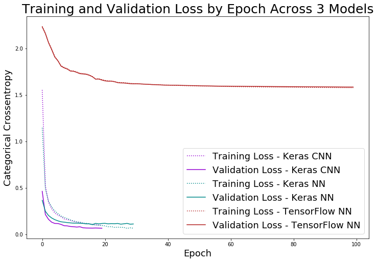

# Kaggle-Handwritten-Digits
Code to predict handwritten digits from Kaggle Dataset.

In order to get practice with different type of neural networks, I first fit the model to a sequential neural network and then fit it to a convolutional neural network. 

I coded one sequential neural network with TensorFlow and one with Keras to practice each syntax. 

See my loss curves for the three models below: 

